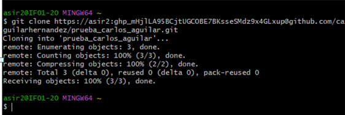
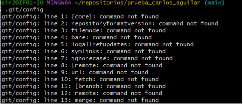
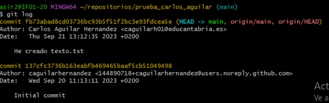
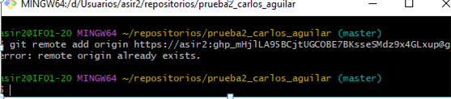

# Taller1

  Creo el repositorio.

  Contenido del fichero .git/config

  Comando git log.

  Creo primero el repositorio local y luego pongo este comando.

  Ya la habia hechoy se me olvido hacerle captura asique repeti el comando.
